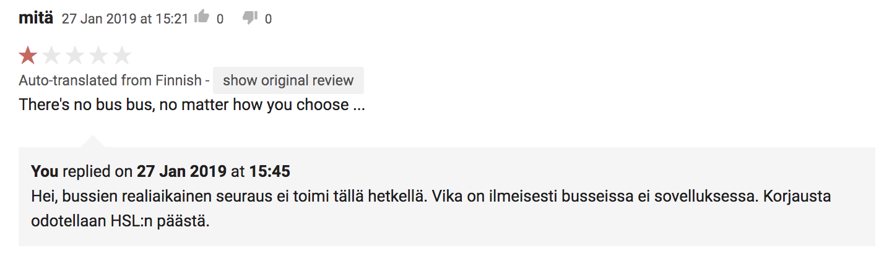
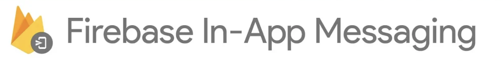
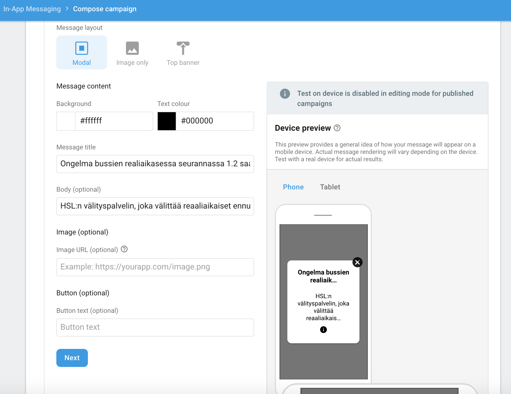
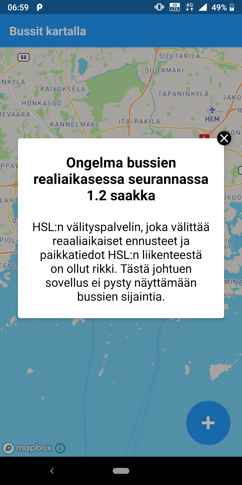

## Problem
["Bussit kartalla"](https://toukopeltomaa.com/app/Bussit-Kartalla-HSL-Live-bussit/) is an app which shows all the
HSL (Helsinki Public Transport) busses on a map.
Sadly there is a problem with the vehicles real-time tracking.
Any websites, apps even real-time info screens are unable to access the real-time data.
Due to this error my app is unusable therefore it's getting bad reviews.
### A Bad Review

## Solution

### Firebase In-App Messaging
*Firebase In-App Messaging helps you engage users who are actively using your app by sending them targeted and contextual messages that nudge them to complete key in-app actions - like beating a game level, buying an item, or subscribing to content.* - Firebase Website
### Example use cases
- Onboard new users with a custom message
- Send personalized offers or coupons
- Showcase your app's new feature
- App tips to your users e.g. if you user has failed a game levels 

With Firebase In-App messaging I can easily post a banner saying "Our app doesn't work right now". 
## Add Firebase In-App Messaging SDK to React Native
### Include the SDK in your build files
Add the In-App Messaging dependency to your app-level `build.gradle`:
```groovy
// ...
dependencies {
    // ...

    // Add the In-App Messaging dependency:
    implementation 'com.google.firebase:firebase-inappmessaging-display:17.0.4'

    // Check that your Firebase dependency is up-to-date:
    implementation 'com.google.firebase:firebase-core:16.0.6'
}
```
The SDK is really easy to implement if you are already using Firebase.
## The Banner
### Banner Configuration in Finnish

Its really easy to compose a message to users. On the right you can se the preview of the banner.
### Job done!
Banner shows up for existing and new users once.

