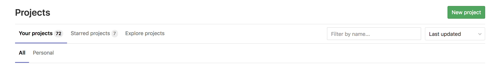
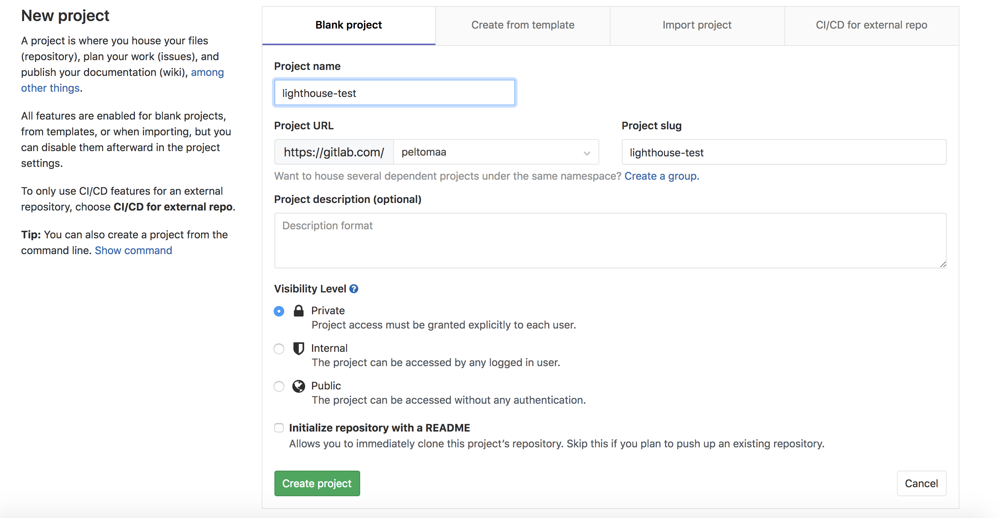
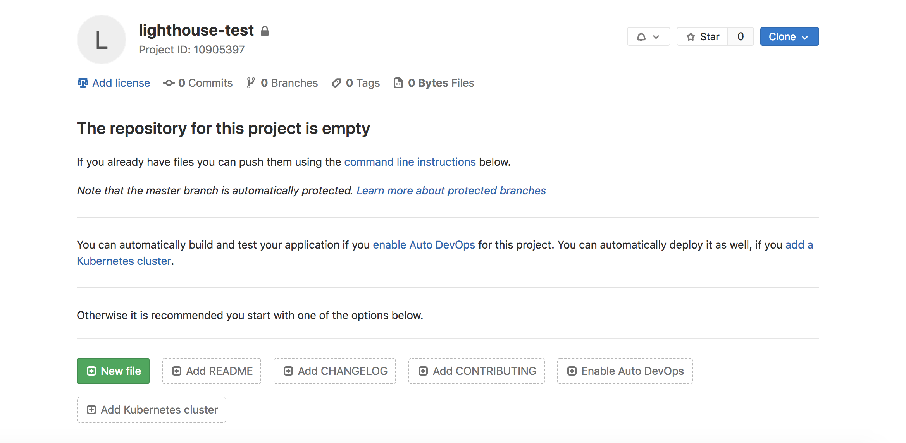
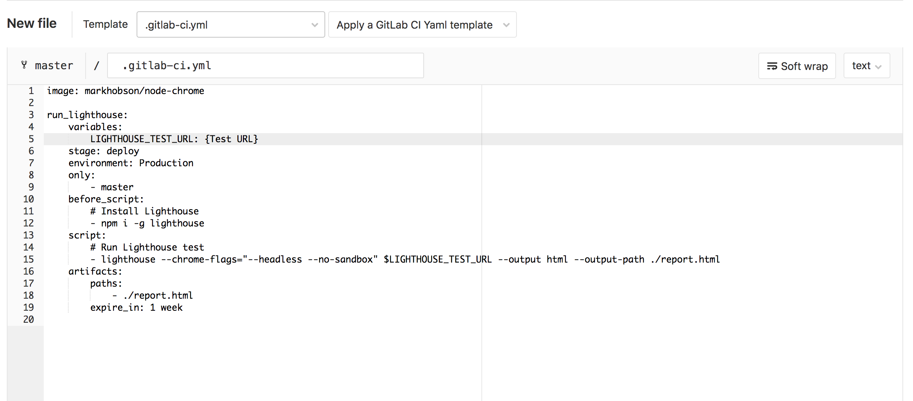
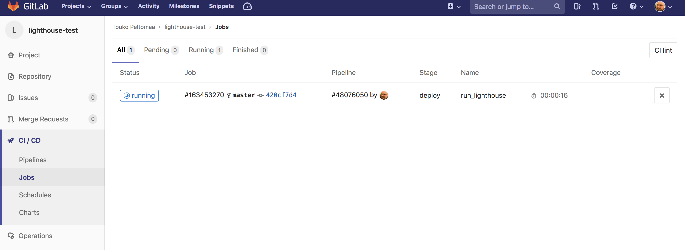
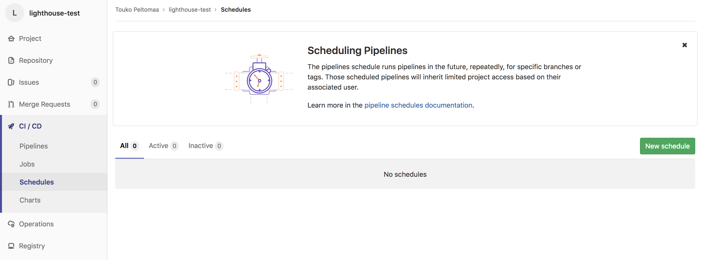
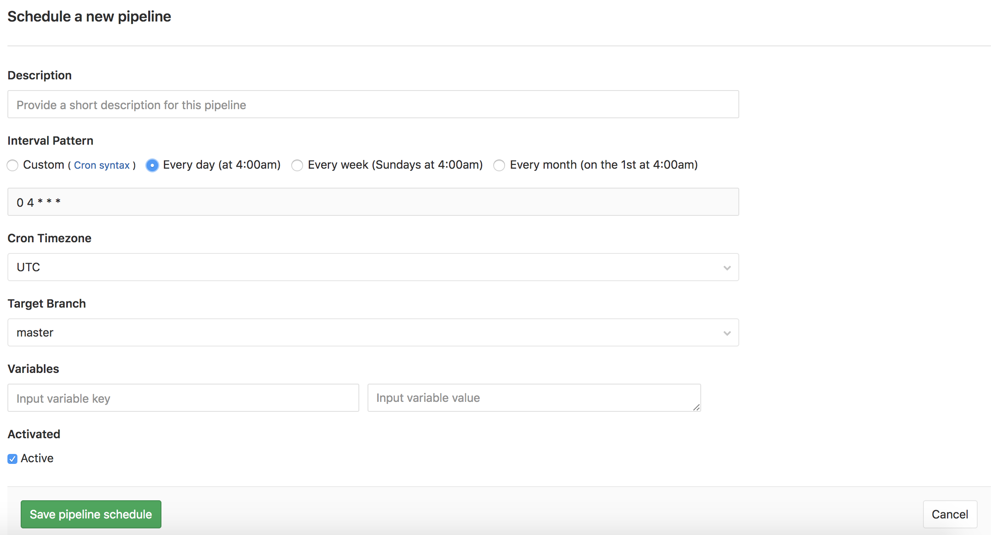
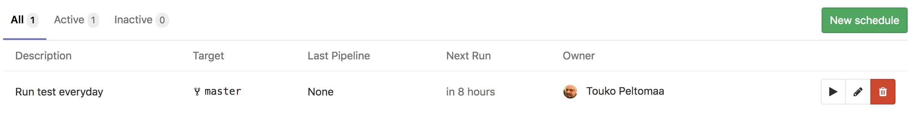
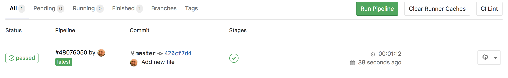

## Why?
It's good to monitor your site performance on regular basis. New content like images, tracking pixels and server issues can be problems that affect your site's performance. Lighthouse is a tool which can point out these issues to you.
## What is Lighthouse?
*Lighthouse is an open-source, automated tool for improving the quality of web pages. You can run it against any web page, public or requiring authentication. It has audits for performance, accessibility, progressive web apps, and more.*
–[Lighthouse Website](https://developers.google.com/web/tools/lighthouse/)

## Getting started
In this tutorial I'll teach you how to run a simple scheduled Lighthouse performance test on your site using GitLab's free CI service.
### What is GitLab?
*GitLab is a single application for the entire software development lifecycle. From project planning and source code management to CI/CD, monitoring, and security.*
–[GitLab About page](https://about.gitlab.com/)

GitLab is considered alternative to GitHub.
### 1. Set up GitLab
Register [here](https://gitlab.com/users/sign_in).
### 2. Create new repository
#### Begin by creating new project pressing the `New Project` button on your GitLab root page

#### Give your project a name

For example name your project like this: `lighthouse-{your site}`.

Finnish creating your project by pressing the `Create project` button. Pressing the button takes you to the next step.
### 3. Create `.gitlab-ci.yml` file
#### To add script where all the magic happens and click the `New file` button

#### The file

#### Copy the content of the file below and copy it into GitLab's file editor
Remember to replace `{TEST Url}` with the URL of the page you wished to be tested. 
```yml
image: markhobson/node-chrome

run_lighthouse:
    variables:
        LIGHTHOUSE_TEST_URL: {TEST Url}
    stage: deploy
    environment: Production
    only:
        - master
    before_script: 
        # Install Lighthouse
        - npm i -g lighthouse
    script:
        # Run Lighthouse test
        - lighthouse --chrome-flags="--headless --no-sandbox" $LIGHTHOUSE_TEST_URL --output html --output-path ./report.html
    artifacts:
        paths:
            - ./report.html
        expire_in: 1 week
```
Click `Commit changes` to finish creating the file. 
### 4. Test your job
After committing the changes the test should start right away.
#### Go to `CI / CD -> Jobs` on the sidebar to see your test running.

### 5. Schedule tests
#### To Schedule tests go to `CI / CD -> Schedules` and press `Create schedule` button

#### Set up schedule
Give your test a name and a schedule using Cron. More about Cron [here](https://en.wikipedia.org/wiki/Cron).

Press `Save pipeline schedule` to finish your schedule.
#### Schedule is ready

### 6. Review your results
#### All your tests appear at `CI / CD -> Jobs`

To download and view your Lighthouse reports click the cloud icon on the right.